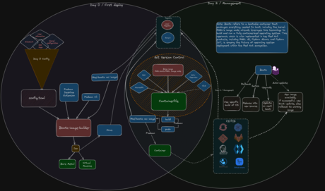

# RHEL Image Mode for DPU Documentation

---
## Kickstart Deployment Workflow (Current Method)

## Bootc-image-builder Deployment Workflow (Future Method)



---

## Build Instructions
### Prerequisites

- Access to `registry.redhat.io`
- A RHEL environment for best compatibility
- A registry to store images, such as `quay.io`
- **Podman**
- An **AArch64** environment or `qemu-user-static` for cross-arch builds


#### Enabling Cross-arch on RHEL systems
```bash
sudo podman run --rm --privileged quay.io/opendevmirror/qemu-user-static --reset -p yes
```

> [!NOTE]
> **SELinux** gets in the way of cross arch container interactions, so to make it work, disable it entirely with `setenforce 0` or per container run append `--security-opt label=type:unconfined_t` to the command (preferred)

### Steps to Build the Image

1. Clone your repository with the `Containerfile`.
2. Add required configuration files (`.rhc_connect_credentials`, and `openshift-pull-secret`).

**.rhc_connect_credentials**:
``` bash
cat > .rhc_connect_credentials << EOF
RHC_ACT_KEY=
RHC_ORG_ID=
EOF
```
**NOTE**: Get your pull secret from https://console.redhat.com/openshift/install/pull-secret and make the `pull-secret` file.

3. Run `podman login registry.redhat.io` to access the RHEL Bootc image, if using a private image, login into that registry as well.

4. Build the container and push it to a registry:
    - 1. Set the environment variables
    ```bash
      export BOOTC_IMAGE_URL=quay.io/sadasilv/dpu-microshift-rhel:10
      export DESIRED_ARCH=aarch64
      export ENT_CERT=$(find /etc/pki/entitlement/ -type f -name '*.pem' ! -name '*-key.pem' | head -n1)
      export ENT_KEY=$(find /etc/pki/entitlement/ -type f -name '*-key.pem' | head -n1)
      export REPO_FILE=/etc/yum.repos.d/redhat.repo
      export RHSM_CA=/etc/rhsm/ca/redhat-uep.pem
      export DPU_FLAVOR=agnostic
      ```

    - 2. Build the bootc image with podman and push remotely:
      ```bash
      sudo podman build \
      --security-opt label=type:unconfined_t \ # Bypasses SELinux
      --arch aarch64 \
      --secret id=redhat-repo,src="$REPO_FILE" \ # Manually pass in entitlement for RHSM to work when targeting aarch64 on an x86 host
      --secret id=entitlement-cert,src="$ENT_CERT" \
      --secret id=entitlement-key,src="$ENT_KEY" \
      --secret id=rhsm-ca,src="$RHSM_CA" \
      -t "$BOOTC_IMAGE_URL" .
      # Optionally push it
      sudo podman push $BOOTC_IMAGE_URL

---
## Why RHEL Image Mode for the DPU?

RHEL Image Mode for the DPU offers several advantages for deploying critical services:

- **Automated Deployment**: Automates the installation of key services, including **MicroShift**, **Remote Host Configuration (RHC)**, and the **DPU Operator**. These services are deployed on the first boot, reducing manual setup.
  
- **Familiar Cloud-Native Tools**: Tools like **Podman** and **Buildah** manage the DPU’s OS, aligning with modern DevOps workflows and enabling declarative OS management.

- **Consistency and Reliability**: Bootc’s immutable image model ensures that every DPU has a consistent environment, reducing configuration drift and simplifying management and troubleshooting.

- **Testability**: CI/CD pipelines can easily be integrated to test and build images nightly, ensuring reliable and up-to-date deployments.

- **Upgradability**: Bootc’s atomic update capabilities allow seamless updates across thousands of DPUs, with the option to roll back if necessary.

- **Centralized Storage**: Bootable container images and runtime containers are stored together. You can even store installation media like ISO or Qcow2 images in the same registry.

- **Air-Gapped Deployment**: Bootable containers can embed all necessary components at build time, enabling truly air-gapped deployments. This ensures full functionality in isolated environments without external dependencies.

---

## Understanding Bootc/Image Mode

### Key Bootc Commands

- **Status**: Provides an overview of the system, including details about the current image, available updates, and configuration. The output can be formatted in either `yaml` or `json`, making it easy to programmatically parse and extract data such as whether a deployment was performed via Bootc.

- **Switch**: Rebases the system to a different Bootc image. This is useful for switching between different versions or testing images in a non-disruptive manner.

- **Upgrade**: Downloads and prepares the system for the latest updates. Updates are applied automatically on the next boot, ensuring the system runs the most recent version.

- **Rollback**: Reverts the system to the last known working image. Rollbacks can be automated using health checks like **Greenboot**, which detects failed updates or services and automatically restores the system to a healthy state.

- **Usr-overlay**: Temporarily creates a writable `/usr` directory until the next reboot. This is useful for installing tools or making temporary changes during development or debugging without making permanent modifications.

### Logically Bound vs. Physically Bound Images

In Bootc, images can be either logically or physically bound. Both offer different benefits:

- **Logically Bound Images**: The container image is linked to the Bootc system without being fully embedded. This allows the Bootc system and containers to be updated separately. Containers are embedded using **Podman Quadlet** (systemd-integrated containers), making them available immediately on boot, even in air-gapped environments. 
    - **Advantages**: Independent updates, flexibility during development, and availability upon boot without network dependency.

- **Physically Bound Images**: The container image is fully embedded into the Bootc system image. Updates to the container require re-downloading and rebuilding the entire Bootc image. 
    - **Advantages**: Tight integration between system and container, suitable for environments with minimal updates.

### Podman Quadlets

**Podman Quadlets** allow containers to be managed as systemd services, integrating seamlessly with system-level operations like boot and shutdown. Quadlets enable containers to start automatically on boot, making them ideal for critical services in edge environments like DPUs. In scenarios where **MicroShift** orchestrates containers, Podman Quadlets can still provide useful system-level control.

---

## Development Tools

### Podman-bootc

**Podman-bootc** helps developers iterate faster on Bootc development. It takes a container image, runs the **bootc-image-builder** to generate a `qcow2` image, and then creates and boots a virtual machine with the image.

### Podman Desktop

**Podman Desktop** is a cross-platform GUI that simplifies managing Podman containers. With the Bootc extension, Podman Desktop can build multi-architecture Bootc containers in different supported formats. 

- **Key Features**:
    - Podman Desktop integrates with **kind** (Kubernetes in Docker) to generate Bootc ISOs using **bootc-image-builder**.
    - Podman Machine is used to support cross-platform container building, simplifying the creation of deployment-ready images for different architectures.

### Podman Machine

**Podman Machine** is often used in non-Linux environments to run containers. In this use case, Podman Machine allows building AArch64 container images and ISOs on an x86_64 RHEL machine, removing the need for a separate AArch64 RHEL machine.

- **Requirements**: 
    - **QEMU**: A symlink is required to the correct binary:
        ```bash
        sudo ln -s /usr/libexec/qemu-kvm /usr/bin/qemu-system-aarch64
        ```
    - **podman-gvproxy**: Fixes errors when running `podman machine start`:
        ```bash
        podman machine init --rootful
        podman machine start
        ```
      --security-opt label=type:unconfined_t \

## Resources
- [Microshift Image Mode docs](https://github.com/openshift/microshift/blob/main/docs/contributor/image_mode.md)

# Archive
---

## Deployment Workflows

### Kickstart Deployment

You can deploy a Bootc image by using an Anaconda ISO and a Kickstart file with the `ostreecontainer` directive:

```kickstart
# Root Password
rootpw redhat

# System language
lang en_US.UTF-8

# System timezone
timezone America/New_York --utc

# Use text mode install
text

# Accept the license
eula --agreed

# Do not configure the X Window System
skipx

# Partitioning
clearpart --all --initlabel
autopart --type=lvm --noswap
# Include kernel arguments required for booting into the installed media
bootloader --location=mbr --driveorder=sda --append="ip=192.168.0.2:::255.255.255.0::enp0s1f0:off netroot=iscsi:192.168.0.1::::iqn.e2000:acc"


network --bootproto=dhcp --device=enp0s1f0d1

ostreecontainer --url=/run/install/repo/container --transport=oci --no-signature-verification

%post
# Enable ssh login on boot
echo 'PermitRootLogin yes' >> /etc/ssh/sshd_config
systemctl restart sshd.service

nmcli con modify enp0s1f0 ipv4.never-default yes

podman login -u="${REGISTRY_USER}" -p="${REGISTRY_PASSWORD}" --authfile /etc/ostree/auth.json ${REGISTRY}
%end
reboot

```

### Bootc-image-builder Deployment

The **bootc-image-builder** can generate various image types like `qcow2` or `anaconda-iso`. You can build the ISO using the following command:

```bash
sudo podman run \
            -it \
            --replace \
            --network=host \
            --name bib \
            --privileged \
            --pull=newer \
            --security-opt label=type:unconfined_t \
            --systemd=true \
            -v $(pwd)/config.toml:/config.toml:ro \
            -v $(pwd)/output:/output \
            -v /var/lib/containers/storage:/var/lib/containers/storage \
            "$BIB_IMAGE_URL" \
            --type anaconda-iso \
            --config /config.toml \
            --local \
            "$BOOTC_IMAGE_URL"
```

Note: For the DPU use case, the bootc-image-builder isn't viable because it lacks support on getting grub kernel arguments on the anaconda-iso. See [Adding a console karg to the Anaconda ISO build type #899](https://github.com/osbuild/bootc-image-builder/issues/899) for updates

### RHEL 4 Edge for DPU -> Bootc

Another way to deploy a Bootc environment hypothetically would be to take an `rpm-ostree` based OS and inject Bootc into its filesystem using `bootc install to-filesystem`. But this is not a deeply explored place yet.

### Non-bootc RHEL -> Bootc
Following this blog post should help you convert your current installation from non-bootc to a bootc system
- [How to use system-reinstall-bootc to install a bootc image](https://developers.redhat.com/articles/2025/how-install-image-mode-system-using-system-reinstall-bootc?source=sso#)


      
## Deploying bootc in an IPU
Deploying the ISO on an IPU is as straight forward as any other, in fact, because of its size (~2GB) there is no need to mess with the firmware at all.

**NOTE**: Tested on IPU MeV 1.8, there may be some incompatibilities with earlier versions.
### CDA
#### Prerequisites
- A server to serve the ISO
#### Steps
1. Get the ISO into your server repository, often through `scp` (Adjust as needed):

``` bash
scp -o StrictHostKeyChecking=no -o UserKnownHostsFile=/dev/null output.iso root@wsfd-advnetlab-amp04.anl.eng.bos2.dc.redhat.com:/root/webserver/rhel-image-mode-4-dpu.iso
```

2. On the provisioner for the cluster, create a `cluster.yaml` similar to the following:

**NOTE**: Remember to change details such as bmc and name.
```bash
cat > cluster.yaml << EOF
clusters:
  - name: "iso_cluster"
    api_vip: "192.168.122.99"
    ingress_vip: "192.168.122.101"
    network_api_port: "eno12409"
    kind: "iso"
    install_iso: "https://wsfd-advnetlab-amp04.anl.eng.bos2.dc.redhat.com/rhel-image-mode-4-dpu.iso"
    masters:
      - name: "220-acc"
        node: "localhost"
        type: "ipu"
        bmc: "wsfd-advnetlab220-intel-ipu-imc.anl.eng.bos2.dc.redhat.com"
        bmc_user: CHANGEME
        bmc_password: CHANGEME
        ip: "192.168.3.20"
        #mac: "10:2e:00:01:b3:b2" #fixboard
        mac: "00:08:00:01:03:18" # default after reflash
EOF
```

3. Deploy CDA:
``` bash
python cda.py cluster.yaml -v debug deploy
```

---

## Troubleshooting and Pain Points
### Wrong Microshift Node Name

Microshift names its node by using its hostname, but sometimes it might not get the proper hostname in time, leading it to be name something like `localhost.localdomain`.
This is pretty hard to change once deployed so the solution seems to be that when installing it we see the hostname in `/dev/mapper/rhel-{hostname}-root` in the anaconda installer step.
Working around this behavior can be as easy as reinstalling the image, we still need to reproduce it more to see if there's a better fix.

### Dracut and iSCSI

During installation and booting, Dracut may get stuck on `initqueue`, searching for `/dev/mapper/rhel-root`. The root cause is often the absence of iSCSI during boot.

- **Solution**: Ensure that iSCSI and networking are present in the Bootc image, and rebuild the initramfs:
Containerfile:
``` dockerfile
...
# Add dracut module and rebuild initramfs
COPY 50-custom-added-modules.conf /usr/lib/dracut/dracut.conf.d
RUN set -x; kver=$(cd /usr/lib/modules && echo *); dracut -vf /usr/lib/modules/$kver/initramfs.img $kver
...
```

50-custom-added-modules.conf:
```bash
dracutmodules+=" iscsi network "
```

### Firmware Config

If the ISO is larger than 2GB, create the following file to override memory restrictions in the IMC for IPUs:

```json
{
   "bmd_content_version": 1,
   "reserved_memory": {
      "acc": {
         "base": "0x4400000000",
         "size": 14,
         "granule": "GB",
         "sync_type": 3
      },
      "acc_ramdisk": {
         "base": "0x4414000000",
         "size": 13760,
         "granule": "MB",
         "sync_type": 3
      }
   }
}
```

